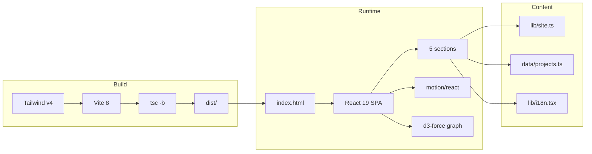

# Documentation

Technical reference for the portfolio. Covers structure, decisions, constraints and known issues.

Reflects the `dev` branch. Dead code, unused dependencies and unimplemented features are documented as they are, not omitted.

## Reference

| Document | Contents |
|---|---|
| [Setup](setup.md) | Environment, commands, folder structure, TypeScript configuration |
| [Architecture](architecture.md) | Render tree, layering, navigation, design decisions |
| [Stack](stack.md) | Library roles, provenance, unused dependencies |
| [Animation](animations.md) | The four animation mechanisms, header spring parameters |
| [Components](components.md) | The five landing sections and their composition |
| [UI Library](ui-library.md) | Inventory of `src/components/ui/`, used vs. unused |
| [Styling](styling.md) | Tailwind v4 CSS-first setup, OKLCH tokens, custom classes |
| [Data & i18n](data-and-i18n.md) | Content modules and the translation system |
| [Known Issues](known-issues.md) | Bug and technical-debt catalogue |

## System overview

## Current state

| Area | Status |
|---|---|
| Router | None. Single page with anchors. `react-router-dom` removed from `package.json` |
| Routing mechanism | Native scroll into view + `history.pushState` |
| `src/components/ui/` | 9 files, all used |
| Theme | Dark only. `class="dark"` hardcoded in `index.html`, no toggle exists |
| Language | `en` / `es` via React context, 33 keys per language |
| Tests | None. Verification is `npm run lint` + `npm run build` |
| Bundle | 477 kB raw, 156 kB gzipped, single chunk, no code splitting |

## Conventions

- **kebab-case filenames** throughout, components included: `site-header.tsx`, `featured-projects.tsx`.
- **`@/` alias** → `src/`, declared in `vite.config.ts` and all three `tsconfig` files.
- **Tailwind v4 with no config file.** All configuration lives in `src/index.css` via `@theme inline` and OKLCH custom properties.
- **Docstrings over inline comments.** Rationale is recorded at the declaration. Generated `ui/` files are exempt — see [UI Library](ui-library.md#docstrings).
- **Section IDs** are the nav contract: `about`, `skills`, `projects`, `contact`. The hero has none.
