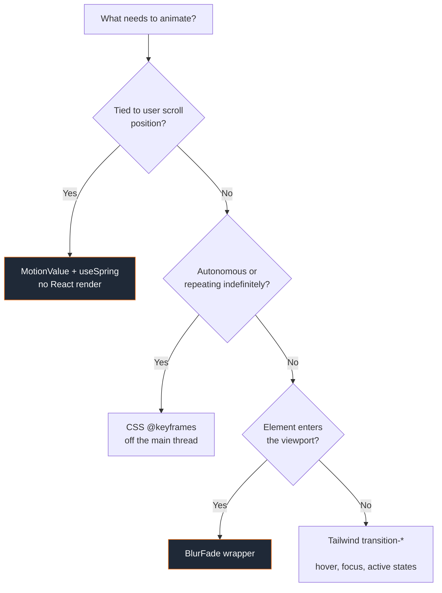
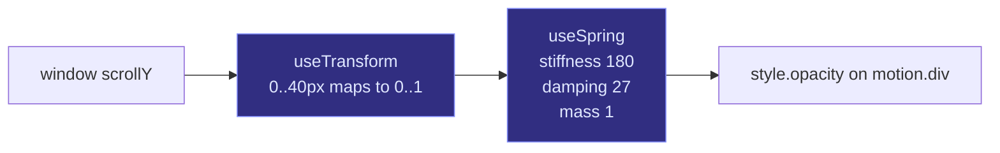
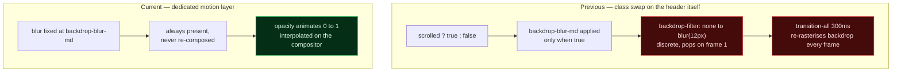
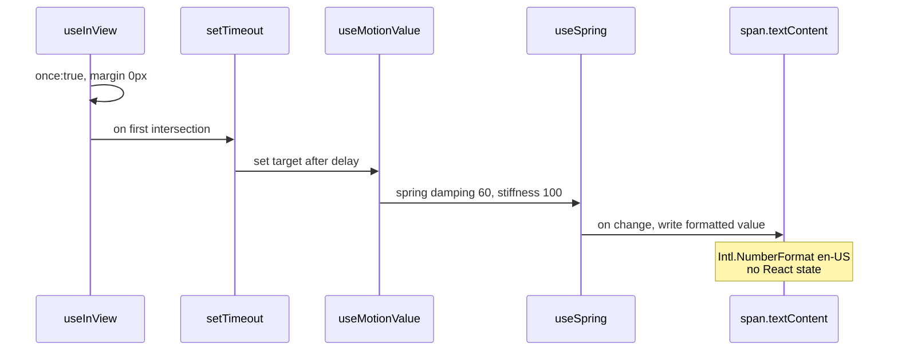
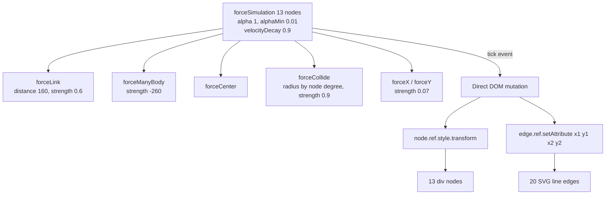
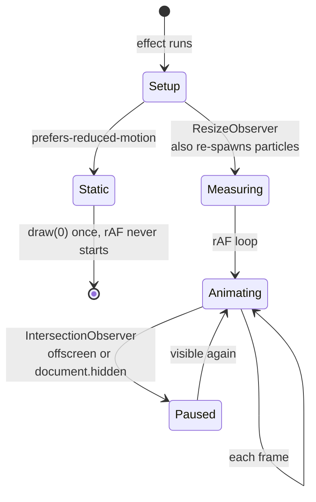

# Animation

The project uses four distinct animation mechanisms. They are not interchangeable; each fits a specific requirement.

## Mechanism selection

| Mechanism | Why it fits | Cost |
|---|---|---|
| `BlurFade` | Needs sequential entry per element, plus directional offset and blur | Creates a `motion.div` wrapper per use |
| Tailwind `transition-*` | Declarative CSS class toggles, no JS involvement | Cannot express physical or stateful motion |
| `@keyframes` CSS | Infinite, non-interactive ambience | No control from React |
| `MotionValue` + `useSpring` | Value must track a physical quantity and still settle over time | Requires careful parameter choice |

## The header spring

### Pipeline

The mapping is deliberately linear. The spring supplies the entire easing characteristic; adding a curve to the mapping as well compounds the delay and produces a sluggish feel.

### Measured response

Critically damped, ωₙ = 13.416 rad/s, ζ = 1.006, natural period 468 ms.

| Elapsed | Opacity | Remaining |
|---|---|---|
| 0 ms | 0.000 | 100% |
| 100 ms | 0.388 | 61.2% |
| 200 ms | 0.748 | 25.2% |
| 300 ms | 0.910 | 9.0% |
| 400 ms | 0.970 | 3.0% |
| 500 ms | 0.991 | 0.9% |
| 600 ms | 0.997 | 0.3% |

ζ = 1.006 sits marginally above critical damping, so there is no overshoot. A header that overshoots past full opacity would read as bouncy.

Adjust `SPRING.stiffness` in `src/hooks/use-header-scroll.ts` to retune. Higher values settle faster; the damping ratio moves with it, so keep `damping` near `2 × √(stiffness × mass)` to stay non-oscillating.

### Why the backdrop is a separate layer

`backdrop-filter` present in only one state is a discrete interpolation: the blur appears at full strength immediately while the background colour is still fading. Keeping the blur at a constant value and animating `opacity` removes the pop and the per-frame re-rasterisation of the filter itself.

The cost is a re-rasterisation of the backdrop for the duration of the transition, which is unavoidable while content moves beneath a fixed blurred element.

## `BlurFade`

`src/components/ui/blur-fade.tsx`. The entrance wrapper used by all five sections.

| Prop | Default | Effect |
|---|---|---|
| `duration` | `0.4` | Seconds |
| `delay` | `0` | Seconds, plus a hard-coded `0.04` base offset |
| `offset` | `6` | Pixels of translation |
| `direction` | `"down"` | `up` / `down` / `left` / `right`; `right` and `down` use negative offset |
| `blur` | `"6px"` | Start filter value |
| `inView` | `false` | `false` forces a mount animation instead of scroll-triggered |
| `inViewMargin` | `"-50px"` | IntersectionObserver root margin |
| `variant` | derived | Replaces the default variants entirely |

`useInView(ref, { once: true })` means each element animates a single time. Sections stagger with `delay={0.15 + i * 0.05}`.

Notable implementation detail: `getFilter()` inspects the merged variants and only adds `filter: { duration }` to the transition when both `hidden` and `visible` define different filter values, so custom variants without a filter do not pay for animating one.

## `NumberTicker`

`src/components/ui/number-ticker.tsx`. Used for the three `About` counters.

The number is never React state. `springValue.on("change", …)` writes `ref.current.textContent` directly.

## `SkillGraph`

`src/components/ui/skill-graph.tsx`. d3-force simulation rendering to DOM and SVG, not canvas.

d3-force without d3-selection. The `tick` handler writes to refs directly, so the simulation runs with zero React renders per frame.

| Concern | Approach |
|---|---|
| Drag | Pointer Events with `setPointerCapture`; writes `node.fx` / `node.fy` |
| Drag heat | `alphaTarget(0.3)` on start, `alphaTarget(0.0001)` on end so the layout micro-settles |
| Bounds | Position clamped to `clamp(width * 0.1, 24, 60)` every tick |
| Resize | `ResizeObserver`; an `appliedSizeRef` guard avoids re-heating the simulation on sub-pixel changes |
| Node size | Derived from graph degree: 28 / 32 / 36 px |
| Mobile | Node and link distances scale down below 480 px |
| Reduced motion | Not handled. The simulation runs regardless |
| Zoom / pan | Not implemented |

## `TechNebulaCanvas`

`src/components/ui/tech-nebula.tsx`. Canvas 2D particle field in the hero. No d3, despite the similar appearance.

| Concern | Approach |
|---|---|
| Particle count | `max(40, floor((w * h) / 7000 * density * viewportScale))`, halved under 640 px |
| Node types | 35% "core" nodes draw a two-tone concentric star; the rest draw a twinkle dot |
| Device pixel ratio | Clamped to 2, applied via `ctx.setTransform` |
| Reduced motion | `matchMedia` read once at setup; the rAF loop is never started and a single static frame is painted |
| Accessibility | `aria-hidden`, `pointer-events-none` |

`IntersectionObserver` pauses the loop when the hero leaves the viewport. When paused or hidden the code still calls `requestAnimationFrame`, which is a cheap busy loop rather than a full cancel.

## Other motion

The remaining registry component with its own animation is `text-animate.tsx`:

| Component | Mechanism | Notes |
|---|---|---|
| `text-animate.tsx` | `motion/react` | `whileInView` + `staggerChildren`; 11 animation presets, splits by text / word / character / line. Renders an `sr-only` copy plus `aria-label` for accessibility |

Everything else in `ui/` animates through `motion/react` via `BlurFade`, `NumberTicker` or the `button`/`badge` hover states, each covered in its own section above.

## Reduced motion coverage

| Location | Handled |
|---|---|
| `tech-nebula.tsx` | Yes — rAF never starts |
| `skill-graph.tsx` | No |
| Header spring | No |
| `BlurFade` | No |
| `text-animate.tsx` | No |

The `::view-transition-old/new(root)` cross-fade remains disabled in `index.css`. It was originally turned off so the theme toggler could own its own `clipPath` animation; the toggler has since been removed, so the override now has no consumer and is a candidate for deletion.
