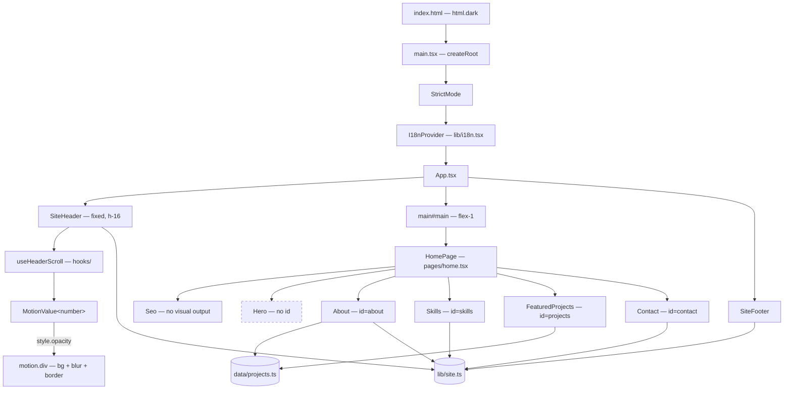
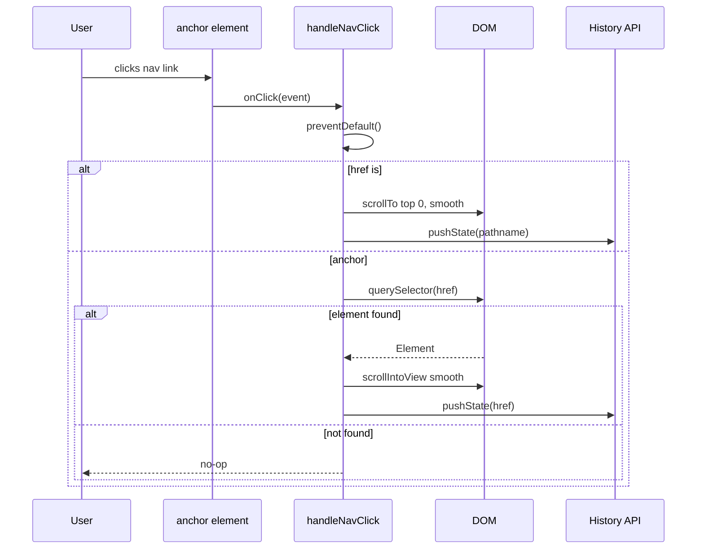
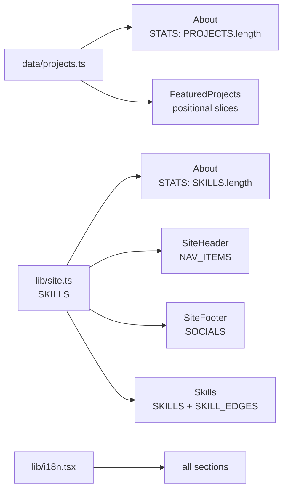

# Architecture

## Render tree



The hero's dashed outline marks the missing section ID. `site-header.tsx` compensates with a special case before querying the DOM.

## Layering

```mermaid
flowchart TD
    subgraph L1["pages/ — composition"]
        PAGES["home.tsx"]
    end
    subgraph L2["components/ — sections and primitives"]
        SECT["hero, about, skills,<br/>featured-projects, contact,<br/>site-header, site-footer, seo"]
        UI["ui/ — 28 primitives"]
    end
    subgraph L3["hooks/ and lib/ — reusable logic"]
        HOOKS["use-header-scroll.ts"]
        LIB["i18n.tsx, site.ts, utils.ts"]
    end
    subgraph L4["data/ — editable content"]
        PROJECTS["projects.ts"]
    end

    L1 --> L2
    L2 --> L3
    L3 --> L4
    L2 --> L4

    classDef leaf fill:#111827,stroke:#374151
    class PROJECTS leaf
```



Imports only move downward. `data/` imports nothing from `components/`; `lib/i18n.tsx` imports no components.

## Navigation



`pushState` updates the address bar without firing `hashchange` or a usable `popstate`, so browser back does not restore the previous section's scroll position. There is no not-found branch handling, so a typo in `NAV_ITEMS` produces a silent dead link.

## Section order

`src/pages/home.tsx` is the only page component. Composition order is fixed:

| # | Component | `id` | Height |
|---|---|---|---|
| 1 | `Seo` | — | — |
| 2 | `Hero` | none | `min-h-[calc(100svh-4rem)]` |
| 3 | `About` | `about` | auto |
| 4 | `Skills` | `skills` | `min-h-svh` |
| 5 | `FeaturedProjects` | `projects` | auto |
| 6 | `Contact` | `contact` | auto |

## Decisions

### No router

`react-router-dom` was removed in commit `b3020ff`. Navigation is anchor-based with programmatic scroll.

Rationale: `dist/` is a static bundle with no server-fallback requirement, and no SPA `404.html` redirect is needed for client routes.

Costs recorded:

- Back button does not restore scroll position.
- `scroll-mt-16` is present only on `#projects`. On `#about`, `#skills` and `#contact` the `h-16` fixed header overlaps the top of the target section.
- The `react-router-dom` package itself was removed from `package.json` in the cleanup pass; `grep -rn "react-router" src/` returns nothing.

### State kept outside React where possible

`SiteHeader` holds one `useState`: `open`, for the mobile menu. Scroll-reactive values are `MotionValue` instances that live outside the React render cycle, are mutated in the frame loop, and are written to the DOM via `style`. No re-render occurs per scroll frame.

Language is React state, in a dedicated context mounted above the tree in `main.tsx`.

### Content as static modules



The `About` counters are computed from array lengths, so they cannot drift out of sync with the content. `FeaturedProjects` is positional, not filtered:

```ts
const flagship = PROJECTS[0]
const secondary = PROJECTS.slice(1, 2)[0]
const tertiary  = PROJECTS.slice(2, 5)
```

Index 5 and beyond are unreachable. A sixth project would not render.

### Four animation mechanisms

| Motion | Mechanism | Scope |
|---|---|---|
| Entrance, scroll-reveal | `BlurFade` (`motion/react`) | All five sections |
| Hover micro-interaction | Tailwind `transition-*` | Cards, buttons, links |
| Continuous ambience | `@keyframes` CSS | Hero clouds, sheen, halo |
| Scroll reaction | `MotionValue` + `useSpring` | Header background |

Mechanism selection is documented in [Animation](animations.md).

### No error boundary

No `ErrorBoundary`, `Suspense` or loading states. Any render error unmounts the tree. `StrictMode` is enabled in development and surfaces effect errors during development only.

## Extension points

**Add a section**

1. Create `src/components/my-section.tsx` exporting `MySection` with `<section id="my-section">`.
2. Mount it in `src/pages/home.tsx`.
3. Add `{ label, href: "#my-section" }` to `NAV_ITEMS` in `src/lib/site.ts`.
4. Add text keys to both dictionaries in `src/lib/i18n.tsx`.
5. Add `scroll-mt-16` to the section class list to offset the fixed header.

**Add a project**

Edit `src/data/projects.ts`. A new entry at index 5 or greater requires changing the `tertiary` slice in `featured-projects.tsx:18`.
