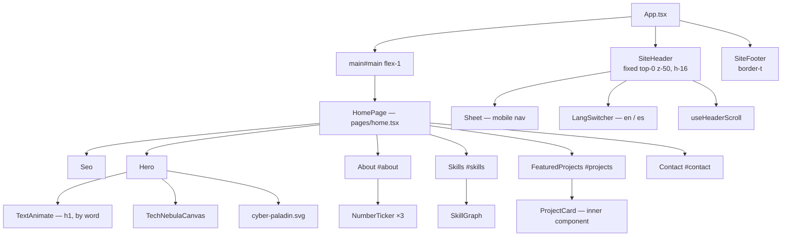
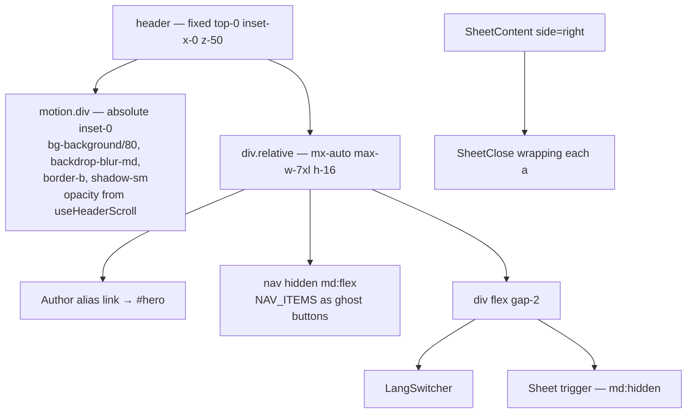
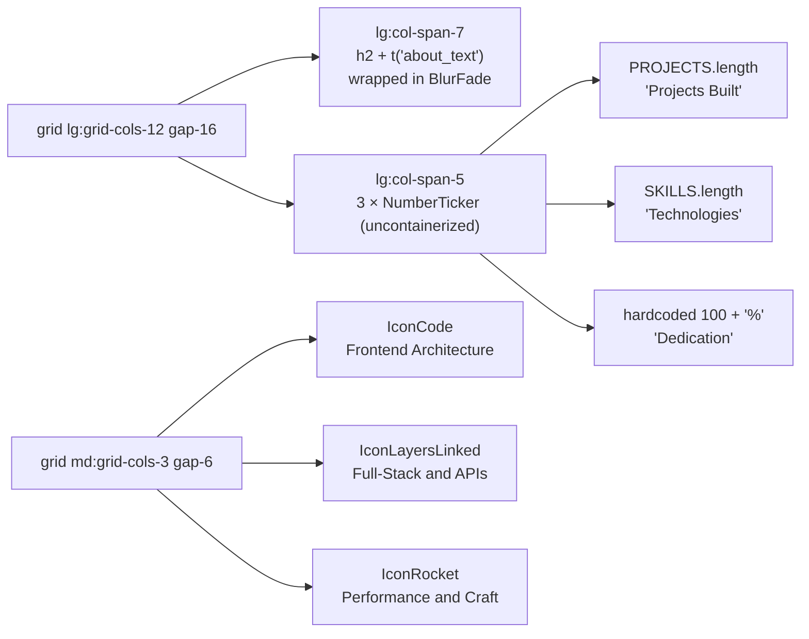
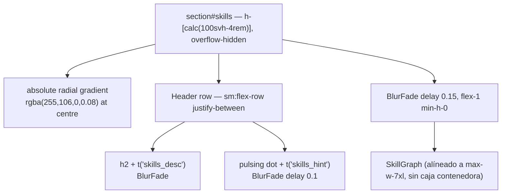
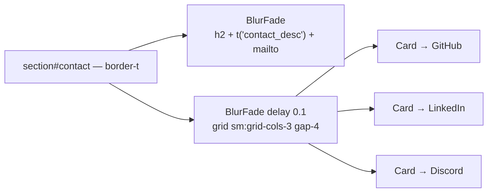
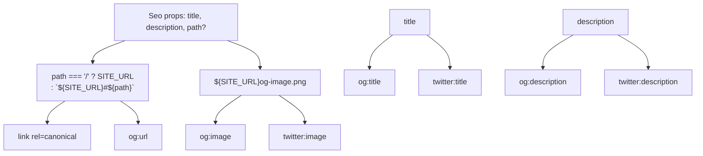

# Components

The five landing sections, plus the shell components.

## Composition



## `SiteHeader`

`src/components/site-header.tsx`. Fixed, full width, `z-50`.



| Element | Detail |
|---|---|
| Background | Dedicated `motion.div`, `pointer-events-none`, `will-change-opacity` |
| Content | `relative` so it paints above the background layer |
| Desktop nav | `hidden md:flex`, `buttonVariants({ variant: "ghost" })` |
| Language | `<div role="group">` with `aria-pressed` on the active button |
| Mobile | `Sheet` from `@base-ui/react/dialog`, `side="right"` |
| `aria-hidden` | On the background layer |

The header is the only place with a `useState`. The background opacity is a `MotionValue` and does not trigger renders. See [Animation](animations.md#the-header-spring).

## `Hero`

`src/components/hero.tsx`. `h-svh min-h-svh max-h-svh` con `pt-16 pb-12 sm:pb-14` — el padding superior de 4rem deja libre el espacio del header fijo, mientras que el padding inferior garantiza que el `ScrollCue` permanezca siempre visible al cargar la página sin desbordar el viewport.

Layout responsivo:
- **Desktop & Tablet (`md:` en adelante)**: Dos columnas (`md:flex-row`). Columna izquierda de texto y columna derecha con el Cyber Paladin escalando verticalmente (`md:max-h-[50vh] lg:max-h-[58vh]`).
- **Mobile (`< md`)**: Apilado vertical compacto. La ilustración del Cyber Paladin se ubica específicamente entre el badge de rol (`AUTHOR_ROLE`) y el encabezado H1 (`AUTHOR_NAME`), con tamaños contenidos (`w-44 sm:w-56 max-h-[22vh]`) para que todo quepa en `100svh`.

| Element | Detail |
|---|---|
| Badge | `AUTHOR_ROLE` rendered directly, bypassing i18n |
| Headline | `TextAnimate` as `h1`, `by="word"`, `animation="blurInUp"` |
| Description | `t("hero_desc")` |
| CTAs | `scrollToProjects` / `scrollToContact` → `scrollIntoView({ behavior: "smooth" })` |
| Illustration | `cyber-paladin.svg`, `max-h-[50vh]` desktop / `max-h-[22vh]` mobile, `object-contain` |
| Scroll cue | `animate-bounce` con texto `scroll` y flecha animada en `bottom-3 sm:bottom-4` |

`HeroBackground` is a local component in the same file. It stacks five CSS atmosphere layers plus the canvas, the vignette and two gradient overlays. Full layer order is in [Styling](styling.md#layer-order-in-the-hero).

The section has no `id`. See [Known Issues B1](known-issues.md#b1--no-idhero).

## `About`

`src/components/about.tsx`. Two-column header grid, then a three-column pillar grid. Lleva `scroll-mt-16` para respetar la cabecera fija.



Counters are derived, not hardcoded — except the third, which is a literal `100` with a `%` suffix. La tira de estadísticas se presenta en formato abierto (sin tarjeta contenedora). Pillars use `delay={0.15 + i * 0.08}` y hover con glow `hover:border-primary hover:shadow-md hover:shadow-primary/10`.

## `Skills`

`src/components/skills.tsx`. `h-[calc(100svh-4rem)] max-h-[calc(100svh-4rem)]` con `scroll-mt-16`. A diferencia del Hero (que inicia en el scroll 0 con header transparente), Skills descuenta estrictamente los 4rem de la barra fija para encajar al 100% en el viewport visible sin desbordamiento vertical.



The glow gradient is an inline `style` object rather than a CSS class, so it does not appear in [Styling](styling.md#custom-component-classes).

`SkillGraph` needs a container with resolved height, which is why the wrapper carries `flex-1 min-h-0` — without `min-h-0` a flex child will not shrink below its content size.

## `FeaturedProjects`

`src/components/featured-projects.tsx`. Bento grid, positional layout.

```mermaid
flowchart TD
    SEC["section#projects — scroll-mt-16"]
    SEC --> HDRBLUR["BlurFade — h2 + t('featured_desc')"]
    SEC --> GRID["grid md:grid-cols-2 lg:grid-cols-12 gap-6 items-stretch"]

    GRID --> A["BlurFade delay 0.05<br/>lg:col-span-8<br/>ProjectCard isSpotlight"]
    GRID --> B["BlurFade delay 0.1<br/>lg:col-span-4<br/>ProjectCard"]
    GRID --> C1["BlurFade delay 0.15<br/>lg:col-span-4<br/>ProjectCard"]
    GRID --> C2["BlurFade delay 0.20<br/>lg:col-span-4<br/>ProjectCard"]
    GRID --> C3["BlurFade delay 0.25<br/>lg:col-span-4<br/>ProjectCard"]

    subgraph CARD["ProjectCard — inner, not exported"]
        CARD --> MEDIA["aspect ratio<br/>spotlight 21/9, others 16/10"]
        CARD --> IMGBADGE["img lazy + overlay + badges"]
        CARD --> BODY["metrics, title, headline,<br/>description line-clamp-3, tag chips"]
        CARD --> ACTIONS["deployUrl → buttonVariants sm<br/>githubUrl → outline if deploy exists"]
    end
```

Layout is driven by array position, not by the `featured` or `category` fields:

```ts
const flagship  = PROJECTS[0]
const secondary = PROJECTS.slice(1, 2)[0]
const tertiary  = PROJECTS.slice(2, 5)
```

`isSpotlight` switches the media aspect ratio and adds the `FLAGSHIP SPOTLIGHT` badge. The only spotlight is `PROJECTS[0]`.

Images resolve through `import.meta.env.BASE_URL` so they work under the GitHub Pages subpath. If `image` is absent, a hardcoded `Preview unavailable` string renders instead.

`featured-projects.tsx` is the only section with `scroll-mt-16`. See [Known Issues B2](known-issues.md#b2--scroll-mt-missing-on-three-sections).

## `Contact`

`src/components/contact.tsx`. Heading, description with a `mailto:` link, then a three-column social grid.



Each social is an `<a>` wrapping a `Card`, with `group-hover:border-[#ff6a00]` on hover. The email address `jromero810@outlook.com` is hardcoded in both the `href` and the link text.

`SOCIAL_ICONS` comes from `lib/site.ts`, shared with `SiteFooter` and typed to require an icon for every `SOCIALS` label.

## `SiteFooter`

`src/site-footer.tsx`. Three-part flex row: copyright with `new Date().getFullYear()`, social icons, and `t("built_with")`.

## `Seo`

`src/components/seo.tsx`. Renders `<title>`, meta description, canonical, Open Graph and Twitter Card. No visual output.



Non-root paths are composed as `SITE_URL + "#" + path`, a hash-based URL. That matches the anchor navigation, though `path` is never passed and the `og:url` always resolves to the root.

`public/og-image.png` is the served asset. `og-image.svg` is the source it was exported from.

## Props summary

| Component | Props |
|---|---|
| `Seo` | `title: string`, `description: string`, `path?: string` (default `/`) |
| `TechNebulaCanvas` | `color`, `accent`, `density`, `linkDistance`, `opacity`, plus `HTMLAttributes<HTMLCanvasElement>` |
| `ProjectCard` | `project: Project`, `isSpotlight?: boolean` — internal, not exported |
| `TextAnimate` | `as`, `by`, `animation`, `delay`, `duration`, `startOnView`, `once` |

## Shared patterns

| Pattern | Implementation |
|---|---|
| Section container | `mx-auto w-full max-w-7xl px-4 md:px-6` — duplicated in all five sections |
| Section header | `BlurFade` wrapping `h2` + `t()` description |
| Stagger | `delay={0.15 + i * 0.05}` or `{0.15 + i * 0.08}` |
| Card surface | `rounded-2xl border bg-card/40 backdrop-blur-md` |
| Card hover | `hover:border-primary/50 hover:shadow-xl hover:shadow-primary/5 hover:-translate-y-1` |
| Asset paths | `${import.meta.env.BASE_URL}${name}` in `hero.tsx` and `featured-projects.tsx` |
