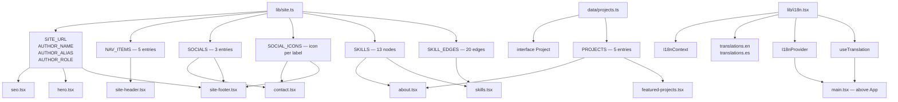
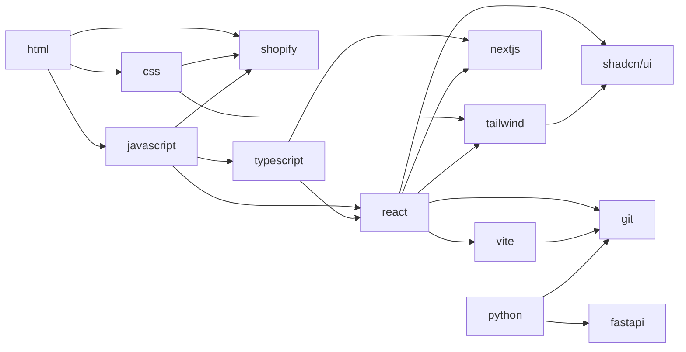
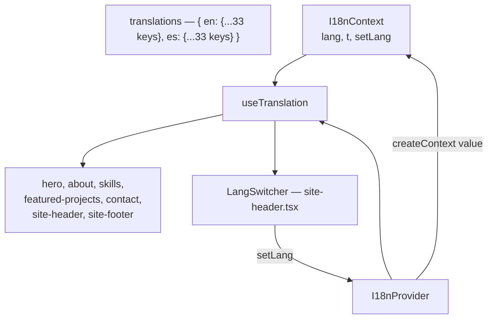
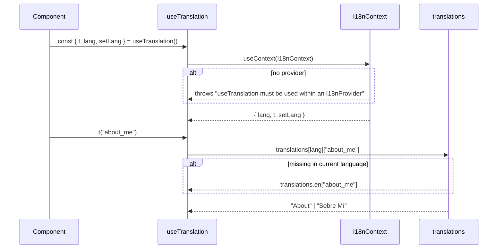
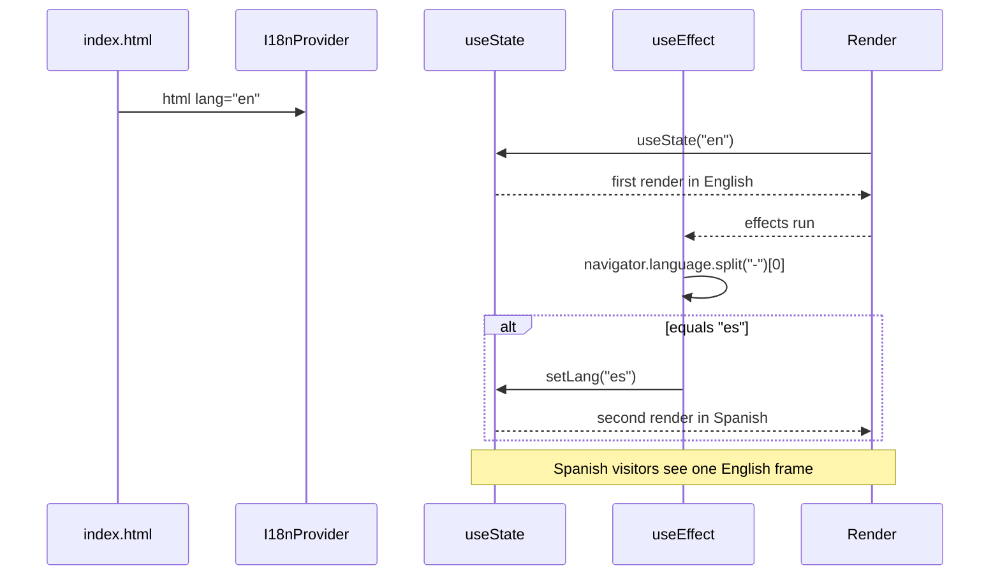

# Data & i18n

Three modules hold all site content. There is no CMS, no API call and no environment variable.

## Module map



## `lib/site.ts`

```ts
export const SITE_URL = "https://its-jrdev.github.io/my-portfolio/"
export const AUTHOR_NAME = "Jose D. Romero"
export const AUTHOR_ALIAS = "Its-JrDev"
export const AUTHOR_ROLE = "Riwi's Coder"
```

`SITE_URL` is the deployed origin, used by `seo.tsx` for canonical and Open Graph URLs. It duplicates the `base` path in `vite.config.ts`; the two must be kept in sync manually.

### `NAV_ITEMS`

```ts
[
  { label: "Home", href: "#hero" },
  { label: "About", href: "#about" },
  { label: "Skills", href: "#skills" },
  { label: "Featured Projects", href: "#projects" },
  { label: "Contact", href: "#contact" }
]
```

`label` is the i18n key, not display text. `site-header.tsx:46` has a `navLabel()` switch mapping each label to a translation key, because `"Featured Projects"` needs to become `t("projects")` rather than `t("Featured Projects")`. The `as const` assertion makes the array readonly and gives literal types.

The header and the section deliberately use different keys — see the naming table in [Known Issues](known-issues.md#naming-convention-header-vs-section).

### `SOCIALS` and `SOCIAL_ICONS`

GitHub, LinkedIn, Discord. `SOCIAL_ICONS` lives beside `SOCIALS` in `lib/site.ts` and is typed as a `Record` over the label union, so adding a social without an icon fails to compile. Both consumers index it without a cast:

```ts
const Icon = SOCIAL_ICONS[social.label]
```

This map was previously duplicated verbatim in `contact.tsx` and `site-footer.tsx`, each casting `social.label as keyof typeof SOCIAL_ICONS`.

### `SKILLS` and `SKILL_EDGES`

Thirteen skill nodes with `id`, `label`, `description`, and twenty edges as `[from, to]` tuples. `skill-graph.tsx` builds an adjacency map from the edges to derive node degree, which drives node size.



An edge referencing an `id` absent from `SKILLS` will not throw; the node simply will not render and `forceLink` will resolve it to `undefined`.

## `data/projects.ts`

```ts
export interface Project {
  title: string
  headline?: string
  description: string
  tags: string[]
  image?: string
  metrics?: string
  category?: "frontend" | "fullstack" | "realtime"
  deployUrl?: string
  githubUrl?: string
}
```

| Field | Rendered as | Notes |
|---|---|---|
| `title` | `h3` | Also the React key in the grid map |
| `headline` | `p` after title | |
| `description` | `p` | `line-clamp-3` |
| `tags` | inline chips | `text-[11px]` bordered spans, not `Badge` |
| `image` | `img` | Resolved as `${BASE_URL}${image}` |
| `metrics` | telemetry line | Preceded by a `size-1.5` primary dot |
| `category` | `Badge` | Translated via a three-way ternary |
| `deployUrl` | "Live demo" button | `buttonVariants({ size: "sm" })` |
| `githubUrl` | "Code" button | Switches to `outline` if `deployUrl` exists |

The five entries:

| # | Title | `category` | Links |
|---|---|---|---|
| 0 | Portfolio Website | frontend | GitHub + deploy |
| 1 | E-commerce Platform | fullstack | GitHub |
| 2 | Chat Application | realtime | GitHub |
| 3 | Weather App | frontend | GitHub |
| 4 | Blog Platform | fullstack | GitHub |

`featured` and `video` were declared on this interface and read nowhere; both were removed along with the three `featured: true` markers.

All images are `.svg` in `public/projects/`:

```
portfolio-cinematic.svg
ecommerce-cinematic.svg
chat-cinematic.svg
weather-cinematic.svg
blog-cinematic.svg
```

`FeaturedProjects` slices by index, so adding an entry past index 4 requires changing the slice. See [Known Issues L1](known-issues.md#l1--bento-grid-caps-at-five-projects).

## `lib/i18n.tsx`

### Structure



```ts
type Language = "en" | "es"
export type Translations = typeof translations.en
```

`Translations` is derived from the `en` object, so the `es` object is not independently type-checked for key parity. A key missing from `es` falls through to the English string.

```ts
const t = (key: keyof Translations) => translations[lang][key] || translations.en[key] || key
```

Three-level fallback: current language → English → the key itself.

### Lookup flow



### B · Initial language detection flashes



`useState` initialises to `"en"`, then a mount effect reads `navigator.language` and calls `setLang("es")`. Under `StrictMode` the effect runs twice.

oxlint reports this as `react/set-state-in-effect`. Fix in [Known Issues B3](known-issues.md#b3--initial-language-detection-flashes).

### Adding a key

Both dictionaries need the key:

```ts
// translations.en
my_new_key: "My new text",

// translations.es
my_new_key: "Mi texto nuevo",
```

Only `en` is type-safe. A key present in `es` but absent from `en` is a type error on `t()`; the reverse is a silent English fallback.

### `LangSwitcher`

Lives inside `site-header.tsx`, not in `i18n.tsx`.

```tsx
<div role="group" aria-label="Language / Idioma">
  {(["en", "es"] as const).map((l) => (
    <button aria-pressed={lang === l} onClick={() => setLang(l)}>
```

The active button gets `bg-primary text-primary-foreground`; the inactive one gets `text-muted-foreground hover:text-foreground`. Both use `transition-colors`.

Language is not persisted to `localStorage`, so it resets to the browser default on every reload.

## Coverage by section

| Section | Keys used |
|---|---|
| `SiteHeader` | `navLabel()` switch — `home`, `about_me`, `skills_nav`, `projects`, `contact_title`, `menu` |
| `Hero` | `hero_desc`, `view_projects`, `get_in_touch` |
| `About` | `about_me`, `about_text`, 3 × `stats_*`, 6 × `about_pillar_*` |
| `Skills` | `skills_title`, `skills_desc`, `skills_hint` |
| `FeaturedProjects` | `featured_title`, `featured_desc`, `spotlight_badge`, 3 × `category_*`, `show_project`, `view_code` |
| `Contact` | `contact_title`, `contact_desc`, `connect_on` |
| `SiteFooter` | `built_with` |

## Hardcoded strings

| Location | String | Notes |
|---|---|---|
| `hero.tsx:60` | `scroll` | decorative, same in both languages |
| `site.ts` → `hero.tsx` | `AUTHOR_ROLE` | hero badge, data not prose |
| `hero.tsx:117` | `alt="Cyber paladin illustration"` | `alt` text, untranslated |
| `featured-projects.tsx:117` | `Preview unavailable` | image fallback |
| `contact.tsx:35,38` | `jromero810@outlook.com` | repeated in `href` and link text |
| `pages/home.tsx:22-23` | `Seo` title and description | Spanish only, not translated |

`Seo` is called once from `home.tsx` with a Spanish-only title and description that do not change with the language. Switching to English leaves the document title in Spanish.
