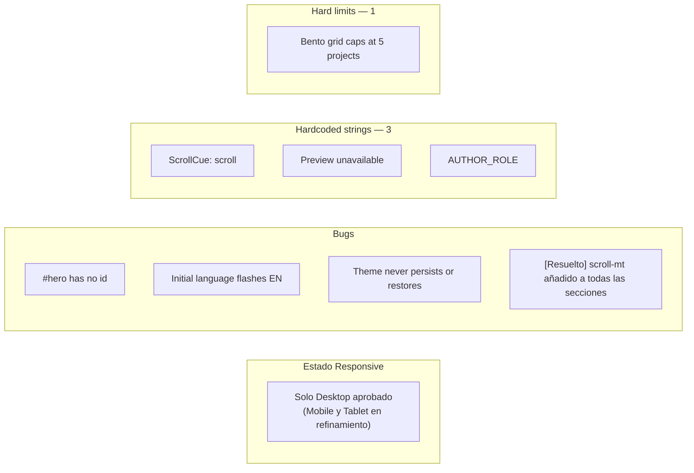
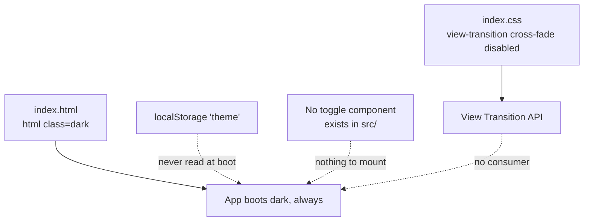

# Known Issues

Catalogue of bugs, hardcoded strings and hard limits still present in the code. Dead code is catalogued separately: see [UI Library](ui-library.md) for component inventory and [Stack](stack.md) for dependencies.

## Summary



## R1 · Responsive: Solo Desktop aprobado

**Estado:** El diseño visual y comportamiento en responsive actualmente cuenta con aprobación formal **únicamente en Desktop (`>= 1024px`)**.

Los viewports de **Mobile (`< 768px`)** y **Tablet (`768px - 1023px`)** están en proceso activo de desarrollo, iteración y refinamiento de UX/UI:
- **Tablet**: Aprovechamiento del espacio en el eje Y del viewport, escala del Cyber Paladin en columnas balanceadas y comportamiento del drawer vs menú de navegación.
- **Mobile**: Integración de la ilustración entre el badge de rol y el título H1 sin desbordar el viewport de `100svh`, garantizando que el indicador de scroll (`ScrollCue`) permanezca siempre a la vista en la carga inicial.
- **Skills**: Cálculo estricto del viewport real restando la barra fija (`h-[calc(100svh-4rem)] max-h-[calc(100svh-4rem)]`) y contención del grafo sin desbordar pantallas pequeñas.

**Consecuencia:** La experiencia en móviles y tablets no se considera finalizada ni aprobada; continuará recibiendo ajustes estéticos y de layout.

## B1 · No `id="hero"`

**State:** `hero.tsx:80` renders `<section className="...">` with no `id`. All four other sections define one.

**Consequence:** `NAV_ITEMS[0]` points at `#hero`. A generic `document.querySelector(href)` returns `null` and the nav link silently does nothing. `site-header.tsx` compensates with a hardcoded special case that scrolls to `top: 0` instead.

**Fix:** add `id="hero"` to the section and remove the special case from `handleNavClick`.

## B2 · `scroll-mt` en todas las secciones [Resuelto]

**Estado:** Anteriormente `#about`, `#skills` y `#contact` carecían de `scroll-mt-16`. 

**Solución aplicada:** Se agregó `scroll-mt-16` a las etiquetas `<section>` de `src/components/about.tsx`, `src/components/skills.tsx` y `src/components/contact.tsx`. Al hacer scroll hacia cualquier ancla, la cabecera fija de 4rem (64px) ya no oculta los títulos de las secciones.

## B3 · Initial language detection flashes

**State:** `lib/i18n.tsx:104`. `useState` initialises to `"en"`, then a mount effect reads `navigator.language` and calls `setLang("es")` at line 110 if it matches.

**Consequence:** Spanish-language visitors render one frame in English before switching. Under `StrictMode` the effect runs twice. oxlint reports this as `react/set-state-in-effect`.

**Fix:** initialise from `navigator.language` in `useState`, or read it once at module scope:

```ts
const INITIAL: Language =
  typeof navigator !== "undefined" && navigator.language.split("-")[0] === "es"
    ? "es"
    : "en"
```

## B4 · Theme never persists or restores

**State:** no theme mechanism exists. Three related facts.



1. `index.html:2` hardcodes `<html lang="en" class="dark">`. Nothing hydrates the theme from storage at boot.
2. There is no toggle component in `src/` — the implementation was removed as dead code along with the `sonner` Toaster that shared its theme logic.
3. `index.css` disables the browser's default root cross-fade so a themed component could own its animation, but no component does.

**Consequence:** the site renders dark exclusively and `localStorage.theme` is never consulted.

**Fix:** decide whether light mode is wanted at all. If yes, add a persisted preference read before first paint plus a toggle in `SiteHeader`. If no, the current state is correct and the disabled view-transition rule plus `@custom-variant dark` can stay as they are.

## Hardcoded strings bypassing i18n

| Location | String | Notes |
|---|---|---|
| `hero.tsx:60` | `scroll` | rendered by `ScrollCue` |
| `featured-projects.tsx:117` | `Preview unavailable` | fallback when `image` is absent |
| `site.ts` → `hero.tsx` | `AUTHOR_ROLE` | hero badge, rendered directly |

These are deliberate: all three are short, decorative or data-shaped rather than prose. The alternative would be three more translation keys with no second language variation.

## L1 · Bento grid caps at five projects

`featured-projects.tsx:37-39` slices by position:

```ts
const flagship  = PROJECTS[0]
const secondary = PROJECTS.slice(1, 2)[0]
const tertiary  = PROJECTS.slice(2, 5)
```

`PROJECTS[5]` and beyond never render. `category` exists on the `Project` interface but drives no filtering — layout is positional. Adding a sixth project requires changing the slice in `featured-projects.tsx`, which also feeds the "Projects Built" counter in `about.tsx`.

## Naming convention: header vs. section

The header nav and the section heading use different keys on purpose:

| Surface | Key | EN | ES |
|---|---|---|---|
| Header nav (desktop + sheet) | `projects` | Projects | Proyectos |
| Section heading | `featured_title` | Featured Projects | Proyectos Destacados |
| Hero CTA | `view_projects` | Featured Projects | Proyectos Destacados |

`navLabel()` in `site-header.tsx` maps `NAV_ITEMS[].label` through `t("projects")`, so the header stays short while the section keeps its full title. The hero CTA matches the section it scrolls to.
