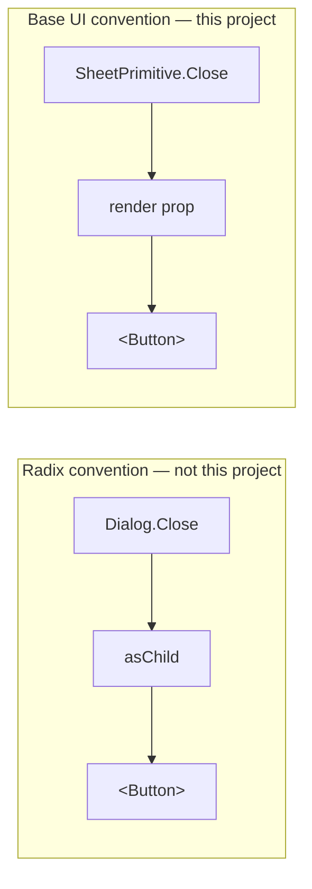

# Stack

## Production dependencies

All 13 packages declared under `dependencies` in `package.json`:

| Package | Version | Role |
|---|---|---|
| `react` / `react-dom` | `^19.2.8` | UI runtime. `StrictMode` enabled in development |
| `motion` | `^13.2.0` | Re-exports `framer-motion` 13.2.0. Entry point `motion/react` |
| `@base-ui/react` | `^1.8.0` | Accessible primitives underlying the shadcn components |
| `class-variance-authority` | `^0.7.1` | Variant definitions in `button.tsx` and `badge.tsx` |
| `cn` | `^0.2.6` | Class merge utility. Standalone package, not `clsx` |
| `d3-force` | `^3.0.0` | Force simulation in `skill-graph.tsx` |
| `@tabler/icons-react` | `^3.46.0` | Icon set declared in `components.json` |
| `tailwindcss` | `^4.3.3` | CSS-first styling. No config file |
| `@tailwindcss/vite` | `^4.3.3` | Vite plugin, replaces the PostCSS pipeline |
| `tw-animate-css` | `^1.4.0` | Supplies `animate-in` / `animate-out`, `fade-in-*`, `zoom-in-*` |
| `shadcn` | `^4.21.0` | CLI plus CSS preset via `@import "shadcn/tailwind.css"` |
| `@fontsource-variable/geist` | `^5.3.0` | Variable font, self-hosted |

## Development dependencies

| Package | Version | Role |
|---|---|---|
| `vite` | `^8.2.2` | Bundler and dev server. `base: "/my-portfolio/"` |
| `typescript` | `~6.0.2` | Typecheck via `tsc -b`. `strict` not enabled |
| `@vitejs/plugin-react` | `^6.1.0` | React plugin for Vite |
| `oxlint` | `^1.79.0` | Linter, replaces ESLint |
| `@types/node` | `^24.13.3` | Node types for `vite.config.ts` |
| `@types/react`, `@types/react-dom` | `^19.2.x` | React types |
| `@types/d3-force` | `^3.0.10` | d3-force types |

`shadcn` is a CLI declared under `dependencies` rather than `devDependencies`. It contributes only the CSS import, so it does not enter the bundle.

## Removed dependencies

Four packages were dropped in the cleanup pass after an import search across `src/` found no consumers:

| Package | Last consumer |
|---|---|
| `react-router-dom` | none — router removed in `b3020ff`, package was left behind |
| `sonner` | `ui/sonner.tsx` + `App.tsx`; nothing ever called `toast()` |
| `lucide-react` | `ui/animated-theme-toggler.tsx`, itself unused |
| `@radix-ui/react-icons` | `ui/bento-grid.tsx`, itself unused |

Verify any dependency is still live the same way:

```bash
grep -rn "from \"<package>" src/
```

## Base UI, not Radix

`components.json` sets `style: "base-nova"`, so the shadcn components wrap `@base-ui/react`. The API differs from the widely documented Radix version.



Enter and exit animations use base-ui's `data-starting-style` and `data-ending-style` attributes rather than a `forceMount` prop. Base UI writes these attributes; Tailwind variant selectors target them:

```tsx
"transition duration-200 ease-in-out data-ending-style:opacity-0 data-starting-style:opacity-0"
```

## Component provenance

The `cn` import path is a reliable origin marker. Full inventory in [UI Library](ui-library.md).

```mermaid
flowchart TD
    UI["src/components/ui/<br/>9 files"]
    UI --> SHADCN["shadcn generated — 4 files"]
    UI --> MAGIC["Magic UI registry — 3 files"]
    UI --> OWN["Hand-rolled — 2 files"]

    SHADCN --> S1["imports cn from 'cn'"]
    MAGIC --> S2["imports cn from '@/lib/utils'"]

    SHADCN --> BU["wraps @base-ui/react<br/>or plain HTML"]
    MAGIC --> BU2["motion/react<br/>CSS keyframes, canvas"]
    OWN --> BU3["d3-force<br/>Canvas 2D"]

    classDef gen fill:#1f2937,stroke:#4b5563
    classDef cus fill:#312e81,stroke:#4f46e5
    class S1,BU gen
    class S2,BU2,BU3 cus
```



## `motion` resolves to `framer-motion`

`framer-motion` is not a direct dependency. It arrives transitively and `motion/react` re-exports its full API.

```bash
npm ls motion framer-motion
# my-portfolio
# └─┬ motion@13.2.0
#   └── framer-motion@13.2.0
```

Import from `motion/react` in all cases. `useScroll`, `useTransform`, `useSpring`, `useInView` and `cubicBezier` are all available through it.

## Lint configuration

`.oxlintrc.json` declares two rules:

```json
{
  "plugins": ["react", "typescript", "oxc"],
  "rules": {
    "react/rules-of-hooks": "error",
    "react/only-export-components": ["warn", { "allowConstantExport": true }]
  }
}
```

`react/only-export-components` and `react/set-state-in-effect` produce the project's four standing warnings:

| File | Warning cause |
|---|---|
| `ui/button.tsx` | Exports `Button` and `buttonVariants` |
| `ui/badge.tsx` | Exports `Badge` and `badgeVariants` |
| `lib/i18n.tsx` | Exports `I18nProvider` and `useTranslation` |
| `lib/i18n.tsx` | `react/set-state-in-effect` for the browser language detection |

These are warnings, not errors. `npm run lint` exits 0 with all four present, so CI does not block on them. The fifth warning, on `ui/navigation-menu.tsx`, went away with that file.

## Bundle composition

Single chunk, no code splitting, 477 kB raw / 156 kB gzipped, plus 61 kB of CSS / 11 kB gzipped.

Main contributors: `motion` and `framer-motion` in full, all nine `ui/` components, `d3-force`, and Tailwind's generated CSS.

Removing the unused components and keyframes cut the CSS from 101 kB to 61 kB — Tailwind v4 only emits utilities that appear in scanned source, so unused files inflated it directly.
