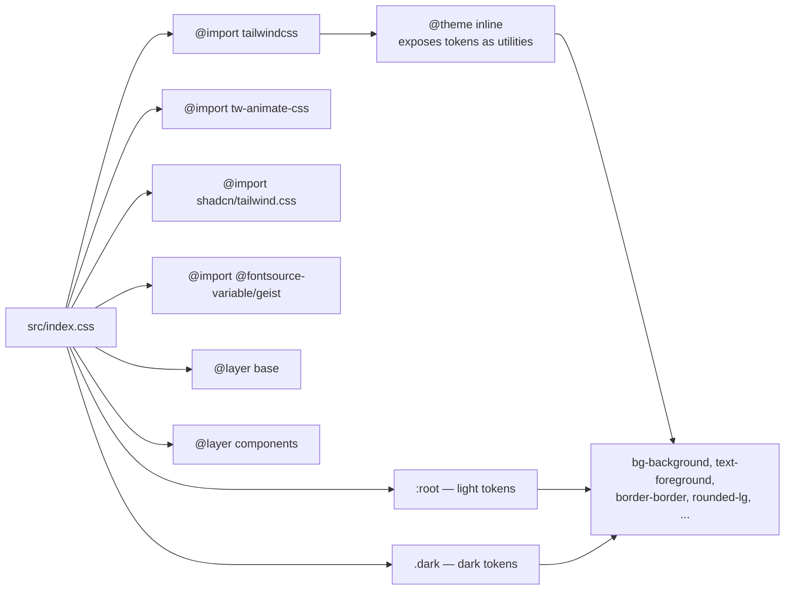
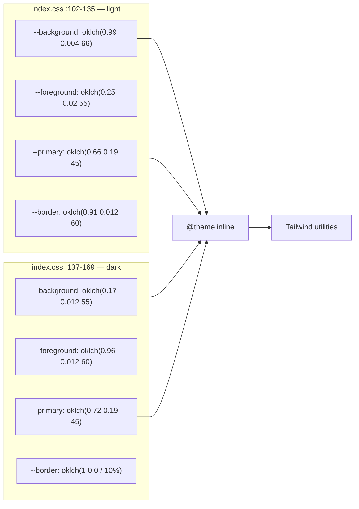
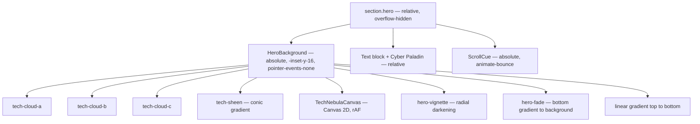

# Styling

## Tailwind v4, CSS-first

There is no `tailwind.config.js` and no `postcss.config.js`. The `@tailwindcss/vite` plugin replaces the PostCSS pipeline and all configuration lives inside `src/index.css`.



## `components.json`

```json
{
  "style": "base-nova",
  "rsc": false,
  "tsx": true,
  "tailwind": { "config": "", "css": "src/index.css", "baseColor": "neutral", "cssVariables": true },
  "iconLibrary": "tabler",
  "aliases": {
    "components": "@/components",
    "utils": "@/lib/utils",
    "ui": "@/components/ui",
    "lib": "@/lib",
    "hooks": "@/hooks"
  },
  "registries": { "@magicui": "https://magicui.design/r/{name}" }
}
```

`"config": ""` is what makes this a v4 CSS-first project. The `hooks` alias is registered but `src/hooks/` contained no files until `use-header-scroll.ts` was added.

## Token system

All colours are OKLCH. `@theme inline` re-exports every token from `:root` and `.dark` as a Tailwind utility, which is why `bg-background`, `text-foreground` and `border-border` resolve.



Both themes share a warm hue angle around 55-66 with the primary on 45, so the palette is a warm off-white / near-black pair with an orange accent.

| Token group | Count | Purpose |
|---|---|---|
| Core | `background`, `foreground`, `card`, `popover`, `primary`, `secondary`, `muted`, `accent`, `destructive` | Surface and text |
| Semantic | `border`, `input`, `ring` | Form and focus |
| Chart | `chart-1` … `chart-5` | Reserved, unused in the current design |
| Sidebar | `sidebar` and 7 variants | Reserved, no sidebar exists |
| Radius | `--radius: 0.625rem` | Drives `rounded-sm` through `rounded-4xl` |

Radius scale is derived, not declared:

| Utility | Calculation | Value |
|---|---|---|
| `rounded-sm` | `0.625rem × 0.6` | 0.375rem |
| `rounded-md` | `0.625rem × 0.8` | 0.5rem |
| `rounded-lg` | `0.625rem` | 0.625rem |
| `rounded-xl` | `0.625rem × 1.4` | 0.875rem |
| `rounded-2xl` | `0.625rem × 1.8` | 1.125rem |
| `rounded-3xl` | `0.625rem × 2.2` | 1.375rem |
| `rounded-4xl` | `0.625rem × 2.6` | 1.625rem |

The dark theme's `--border` and `--input` are alpha-based (`oklch(1 0 0 / 10%)` and `/ 15%`) rather than opaque, so borders composite over whatever is behind them. This matters for the `backdrop-blur` surfaces.

## Dark variant

```css
@custom-variant dark (&:is(.dark *));
```

The `:is(.dark *)` form means the variant matches any descendant of `.dark`, not just `.dark` itself.

Dark is the only active theme. `index.html` sets `class="dark"` on `<html>` and no toggle is mounted — see [Known Issues B4](known-issues.md#b4--theme-never-persists-or-restores).

## Fonts

`@fontsource-variable/geist` is imported in CSS, which bundles the variable font locally. `--font-sans` is `'Geist Variable', sans-serif` and `--font-heading` is aliased to it, so `font-heading` and `font-sans` are visually identical by design.

The `index.html` includes `preconnect` to github.com and linkedin.com for the social links.

## Custom component classes

Defined in `@layer components`, not in Tailwind's `@apply` registry. They are used directly as class names.

### Hero atmosphere

| Class | `index.css` | Blur | Animation |
|---|---|---|---|
| `hero-vignette` | 188-194 | — | none |
| `hero-fade` | 196-198 | — | none |
| `tech-cloud-a` | 202-214 | 110px | `tech-drift-a` 24s |
| `tech-cloud-b` | 216-228 | 100px | `tech-drift-b` 19s |
| `tech-cloud-c` | 230-242 | 150px | `tech-drift-c` 30s |
| `tech-sheen` | 244-257 | 80px | `tech-spin` 48s |
| `tech-halo` | 259-269 | 60px | `tech-halo-pulse` 9s |

All five motion classes share the same three-part pattern for GPU compositing:

```css
filter: blur(Npx);
mix-blend-mode: screen;
will-change: transform;
transform: translate3d(0, 0, 0);
```

`translate3d(0,0,0)` and `will-change: transform` are redundant with each other; both force layer promotion. `mix-blend-mode: screen` requires the elements to blend with each other, so they are all `absolute inset-0` siblings in `HeroBackground` (`hero.tsx:10-34`).

`tech-sheen` additionally animates `opacity` in its `will-change` alongside `transform`.

### Layer order in the hero



Paint order is DOM order, so the canvas sits above the clouds and below the vignette. The vignette darkens the canvas edges, and `hero-fade` blends the bottom into the next section.

## Base layer

```css
@layer base {
  * { @apply border-border outline-ring/50; }
  body { @apply bg-background text-foreground; }
  html { @apply font-sans; }
}
```

The universal `border-border` means every element carries a border colour, so `border` on a single side uses the token automatically. The universal `outline-ring/50` sets the default focus outline colour; no focus-visible styles are defined beyond it.

## View transitions

```css
::view-transition-old(root), ::view-transition-new(root) {
  animation: none;
  mix-blend-mode: normal;
}
```

Deliberately outside `@layer base` (after the closing brace at line 181). This disables the browser's default root cross-fade so the theme toggler's own `clipPath` animation is the only thing running. Since that component is unmounted, no View Transition occurs anywhere in the app.

## Layout conventions

| Convention | Value |
|---|---|
| Container | `mx-auto w-full max-w-7xl px-4 md:px-6` |
| Section padding | `py-16 md:py-24` or `py-20 md:py-28` |
| Section border | `border-t border-border/40` |
| Header height | `h-16` (4rem) |
| Scroll offset | `scroll-mt-16` — only on `#projects` |
| Card radius | `rounded-2xl` |
| Bento breakpoints | 1 col → `md:grid-cols-2` → `lg:grid-cols-12` |

Every section repeats the same container string. It is duplicated across all five rather than extracted to a component or a `@utility` in `index.css`.
