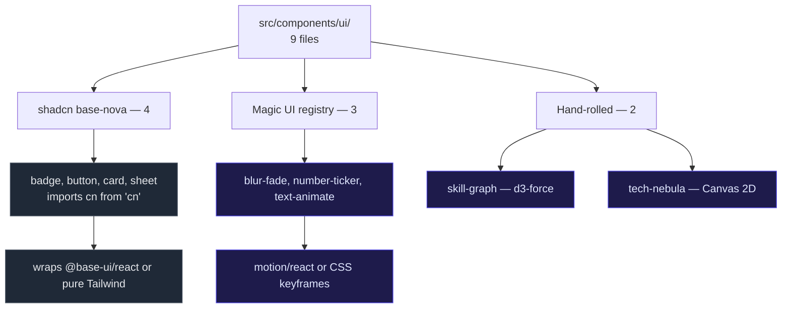

# UI Library

Inventory of `src/components/ui/`: 9 files, all used.

## Provenance



`components.json` registers `https://magicui.design/r/{name}` as `@magicui`, which is how the registry components were installed.

The `cn` import path is the reliable origin marker: shadcn files take `cn` from the `cn` package, Magic UI and hand-rolled files take it from `@/lib/utils`. `blur-fade.tsx` imports neither.

## Components

| File | Lines | Exports used | Consumers | Mechanism |
|---|---:|---|---|---|
| `blur-fade.tsx` | 92 | `BlurFade` | `about`, `contact`, `featured-projects`, `skills` | `motion/react`, `useInView` |
| `skill-graph.tsx` | 454 | `SkillGraph` | `skills` | `d3-force`, direct DOM refs |
| `tech-nebula.tsx` | 236 | `TechNebulaCanvas` | `hero` | Canvas 2D, rAF, `IntersectionObserver` |
| `text-animate.tsx` | 445 | `TextAnimate` | `hero` | `motion/react`, `whileInView` |
| `number-ticker.tsx` | 72 | `NumberTicker` | `about` | `useSpring` + `textContent` writes |
| `button.tsx` | 57 | `Button`, `buttonVariants` | `hero`; header, featured-projects | `@base-ui/react/button` + `cva` |
| `badge.tsx` | 51 | `Badge` | `hero`, `featured-projects` | `cva` + base-ui `useRender` |
| `card.tsx` | 74 | `Card`, `CardHeader`, `CardTitle`, `CardDescription`, `CardContent` | `featured-projects`, `contact` | Pure Tailwind |
| `sheet.tsx` | 136 | `Sheet`, `SheetTrigger`, `SheetContent`, `SheetHeader`, `SheetTitle`, `SheetClose` | `site-header` | `@base-ui/react/dialog` |

`card.tsx` exports exactly what is consumed — `CardFooter` and `CardAction` were removed along with the `has-data-[slot=card-footer]` and `has-data-[slot=card-action]` selectors in `Card` and `CardHeader`.

## Notable component details

### `sheet.tsx` is a Dialog

Wraps `@base-ui/react/dialog`, not a dedicated drawer primitive. The slide-in behaviour is entirely CSS. `SheetOverlay` and `SheetPortal` are defined but intentionally unexported, internal to `SheetContent`.

The close button is composed with base-ui's `render` prop:

```tsx
<SheetPrimitive.Close render={<Button variant="ghost" size="icon-sm" />}>
  <IconX />
  <span className="sr-only">Close</span>
</SheetPrimitive.Close>
```

### `badge.tsx` and `button.tsx` are polymorphic

Both use `class-variance-authority` plus base-ui's `useRender` / `render` prop so a single component can render as `<a>` or `<button>`. This is why they trigger `react/only-export-components`: they export both the component and its `*Variants` object.

### `skill-graph.tsx` sizing

Node diameter is derived from graph degree in the `SKILL_EDGES` adjacency map:

| Degree | Size | `nodeSize()` | `dotInset()` |
|---|---|---|---|
| ≥ 5 | 36 px | `36` | `6px` |
| ≥ 3 | 32 px | `32` | `6px` |
| < 3 | 28 px | `28` | `5px` |

`nodeSize` has three distinct outcomes; `dotInset` has two, since the top two degree bands share an inset.

### `tech-nebula.tsx` resize behaviour

`ResizeObserver` re-measures and calls `spawn()`, which re-randomises all particle positions. Any resize tick therefore fully re-randomises the field rather than preserving it.

## Docstrings

Docstrings are present on project-owned files. Files installed from the shadcn CLI or the Magic UI registry are left without them, because `npx shadcn add` and `npx shadcn@latest add` overwrite them on update and the comments would be lost.

The two hand-rolled files, `skill-graph.tsx` and `tech-nebula.tsx`, are documented since they are not registry output.
